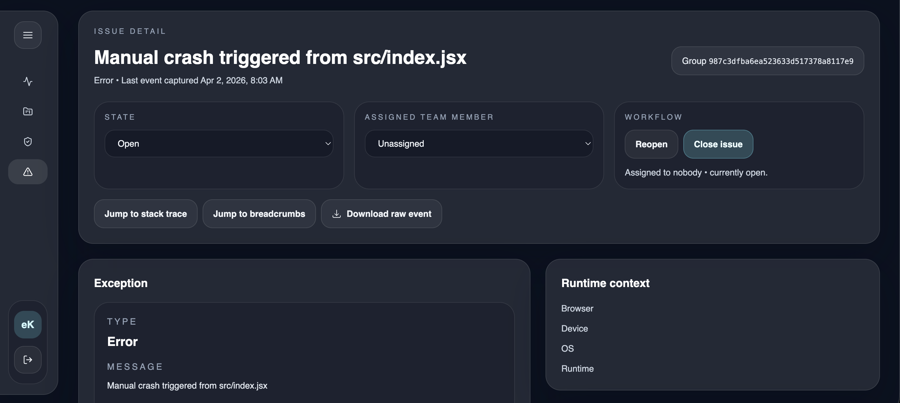

# eKeeper

eKeeper is a self-hostable error monitoring and incident triage platform built for teams that want a Sentry-compatible ingestion path with a more controlled, product-specific workflow.

It combines:
- Sentry SDK-compatible event intake
- grouped issue views with stack traces and breadcrumbs
- project-based access control
- issue assignment and lifecycle workflow
- a polished glass-style enterprise dashboard

## Features

### Monitoring
- project-level error tracking
- grouped issues based on fingerprints and normalized exception shape
- event detail views with request info, tags, contexts, stack frames, and breadcrumbs
- 7-day dashboard rollups by project

### Workflow
- assign issues to a project team member
- mark issues as open, closed, or reopened
- filter issues by state and assignment

### Access Control
- Google SSO login
- allowed-domain enforcement
- workspace roles: `admin`, `manager`, `viewer`
- project membership controls

### Developer Experience
- versioned SQLite and ClickHouse migrations on boot
- Vite frontend dev server
- Bun backend autoreload in dev
- Docker Compose for ClickHouse and backend
- VS Code launch configuration for frontend + backend

## Documentation

- [Backend Architecture](docs/backend-architecture.md)
- [Frontend Architecture](docs/frontend-architecture.md)
- [Development Setup](docs/development-setup.md)
- [Production Deployment](docs/production-deployment.md)

## License
Licensed under the terms in the [LICENSE](/LICENSE) file.

## Author

* Pankaj Soni <pankajsoni19@live.com>
